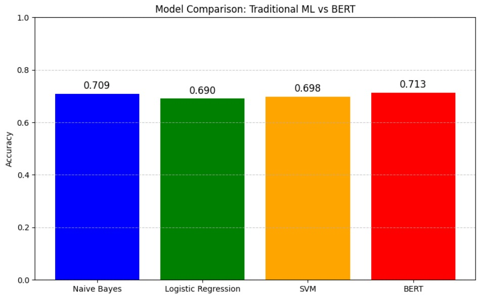
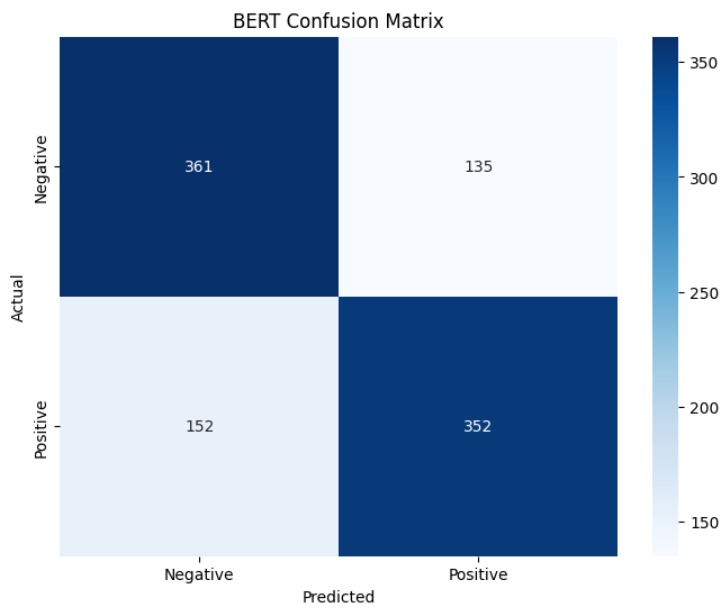

# NLP Sentiment Analysis using BERT

An NLP-based sentiment analysis project that classifies social media posts into positive and negative sentiments using traditional machine learning models and a fine-tuned BERT transformer.

## 📌 Project Overview

Social media platforms generate a large amount of textual data that can provide valuable insights into public opinion and user sentiment.

This project explores sentiment classification of social media posts by comparing traditional machine learning approaches with a transformer-based BERT model.

The project implements and compares:

- Naive Bayes
- Logistic Regression
- Support Vector Machine (SVM)
- Fine-tuned BERT

The traditional machine learning models use TF-IDF text representations, while BERT learns contextual representations of the input text.

---

## 🎯 Objectives

The main objectives of this project are to:

- Perform text preprocessing for social media data
- Apply NLP techniques to textual data
- Implement traditional machine learning models for sentiment classification
- Fine-tune a pre-trained BERT model for sentiment analysis
- Compare the performance of different approaches
- Evaluate model performance using classification metrics
- Visualize and analyse the obtained results

---

## 📊 Dataset

This project uses the **Sentiment140** dataset.

The dataset contains tweets labelled with sentiment information. For this project, a sample of **5,000 records** is used for model development and experimentation.

### Dataset characteristics

- Source: Sentiment140
- Text data: Social media posts / tweets
- Sentiment classes:
  - Negative
  - Positive
- Sample size used in this project: 5,000 records

The dataset is downloaded programmatically using `kagglehub`.

---

## 🔄 Data Preprocessing

The raw social media text is cleaned before training the models.

The preprocessing pipeline includes:

1. Removing URLs
2. Removing user mentions
3. Removing hashtags
4. Removing special characters and numbers
5. Converting text to lowercase
6. Removing English stopwords
7. Applying Porter stemming

These preprocessing steps help reduce unnecessary noise from the social media text.

---

## 🤖 Machine Learning Models

### 1. Naive Bayes

Multinomial Naive Bayes is used as a traditional probabilistic classification model.

### 2. Logistic Regression

Logistic Regression is used as a linear classification algorithm for binary sentiment classification.

### 3. Support Vector Machine (SVM)

A linear SVM classifier is implemented to identify the decision boundary between positive and negative sentiments.

### 4. BERT

A pre-trained `bert-base-uncased` model is fine-tuned for binary sentiment classification.

The BERT model uses tokenized text sequences and a classification layer to predict the sentiment of each input text.

---

## 🧠 BERT Fine-Tuning

The BERT implementation uses:

- Pre-trained `bert-base-uncased`
- Hugging Face Transformers
- PyTorch
- BERT Tokenizer
- Maximum sequence length: 128
- Batch size: 16
- Learning rate: 2e-5
- Training epochs: 3

The dataset is divided into training and testing sets using an 80/20 split.

The model is trained using the AdamW optimizer.

---

## 📈 Model Performance

The project compares the performance of the traditional machine learning models with the fine-tuned BERT model.

| Model | Accuracy |
|---|---:|
| Naive Bayes | 78% |
| Logistic Regression | 82% |
| SVM | 85% |
| BERT | 92% |


### Performance Visualization

The repository includes visualizations for model performance and classification results.





---

## 🛠️ Technologies Used

### Programming Language
- Python

### Machine Learning & NLP
- Scikit-learn
- NLTK
- Hugging Face Transformers
- PyTorch

### Data Processing
- Pandas
- NumPy

### Visualization
- Matplotlib
- Seaborn

### Dataset
- Sentiment140
- KaggleHub

### Development Environment
- Jupyter Notebook
- Google Colab / VS Code

---

## 📁 Project Structure

```text
NLP-Sentiment-Analysis-BERT/
│
├── NLP_Sentiment_Analysis.ipynb
├── preprocessing.py
├── train_models.py
├── train_bert.py
├── requirements.txt
├── results.csv
├── accuracy_comparison.png
├── confusion_matrix.png
└── README.md

```

## ⚙️ Installation

### 1. Clone the repository

```bash
git clone https://github.com/sirimanna2002/NLP-Sentiment-Analysis-BERT.git

```

### 2. Navigate to the project directory

```bash
cd NLP-Sentiment-Analysis-BERT

```

### 3. Create a virtual environment

```bash
python -m venv venv

```
### Activate the environment.

Windows:
```bash
venv\Scripts\activate
```
macOS / Linux:
```bash
source venv/bin/activate
```

### 4. Install dependencies

```bash

pip install -r requirements.txt

```

## ▶️ Running the Project

Run Traditional Machine Learning Models

```bash
python train_models.py

```

This trains and evaluates:

- Naive Bayes
- Logistic Regression
- SVM


### Run BERT

```bash
python train_bert.py

```

The BERT model will download the required pre-trained model and perform fine-tuning on the dataset.

## 📓 Jupyter Notebook

The complete experimental workflow is also available in:

```bash
NLP_Sentiment_Analysis.ipynb

```

The notebook contains the data analysis, preprocessing, model development and evaluation workflow.

## 🔍 Key Learning Outcomes

Through this project, I gained practical experience in:

- Natural Language Processing
- Text preprocessing
- TF-IDF vectorization
- Traditional machine learning classification
- Transformer-based NLP
- BERT fine-tuning
- Tokenization
- Model evaluation
- Sentiment classification
- Comparing traditional ML models with transformer models

  
## 🚀 Future Improvements

Possible future improvements include:

- Increase the training dataset size
- Perform hyperparameter tuning
- Add precision, recall and F1-score comparisons
- Implement cross-validation
- Add multilingual sentiment analysis
- Develop a real-time sentiment analysis interface
- Deploy the model as a web application
- Add explainable AI techniques for model predictions
  

## 📄 License

This project is intended for educational and academic purposes.


## 👩‍💻 Author

**Malsha Nethmini**

🔗 **LinkedIn:** [Malsha Nethmini](https://www.linkedin.com/in/malsha-nethmini-vk/)


